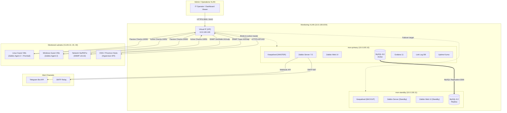
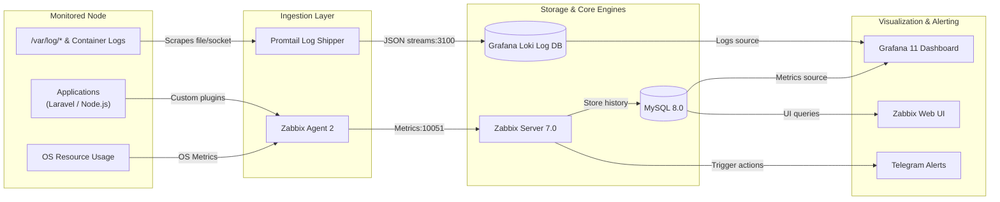

# System Design Architecture Diagrams

This document contains visual representations of the enterprise monitoring stack design using Mermaid.

---

## 1. High-Availability (HA) Network Architecture

This diagram shows the network setup, VLAN segmentations, and how Keepalived manages the Virtual IP (VIP) failover between `mon-primary` and `mon-standby`.

---

## 2. End-to-End Log & Metric Data Flow

This flowchart traces metrics from monitored systems through the ingestion components and database to the visualization layer.

